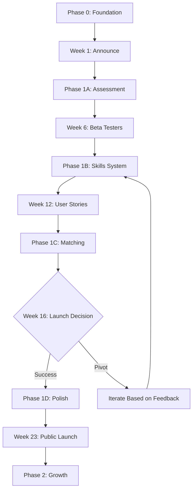

# SkillTree Development Roadmap

**Last Updated:** November 20, 2025
**Status:** Active Development
**Context:** Solo dev, part-time (10-20 hrs/week), build-in-public approach

---

## Overview

Roadmap ini memecah pengembangan SkillTree menjadi fase-fase yang manageable, dengan fokus pada delivery value incremental kepada users. Setiap fase memiliki:
- **Development milestones** (feature shipping)
- **Content milestones** (build-in-public sharing)

**Single source of truth:** Development + Marketing combined

---

## Development Phases

```
Phase 0: Foundation (Weeks 1-3)
    ↓
Phase 1: MVP Core (Weeks 4-23) ← FOCUS FIRST
    ↓
Phase 2: Growth Features (Months 7-12)
    ↓
Phase 3: Scale & Monetization (Months 13-24)
```

**Adjusted Timeline:**
- Team 4-5 engineers: 16 weeks MVP
- Solo part-time + AI: **20-23 weeks MVP** (realistic)

---

## Phase 0: Foundation (Weeks 1-3)

### Goal
Setup infrastructure & tooling + announce publicly

### Development Deliverables
- ✅ Project structure (Next.js + Supabase + Prisma)
- ✅ Dev environment setup
- ✅ Core tech stack configured
- ✅ Database schema designed
- ✅ O*NET API integration (70 occupations, 50 skills)

### Content Milestones
- **Week 1, Day 1:** Public announcement (Twitter + LinkedIn)
  - "Building SkillTree in public" thread
  - GitHub repo made public
  - Landing page live (even if just "coming soon")
- **Week 2:** Tech stack decisions shared
  - Why Supabase over Clerk?
  - O*NET API strategy explained
- **Week 3:** First demo video
  - Project structure walkthrough
  - Database seeded (screenshot of data)

**Success Criteria:**
- [ ] Can run app locally with AI assistance
- [ ] Database seeded with 70 occupations, 50 skills
- [ ] 50-100 Twitter followers / waitlist signups

**Detailed Plan:** `phase-0-foundation.md` + `BUILD_IN_PUBLIC_STRATEGY.md`

---

## Phase 1: MVP Core (Weeks 4-23) ⭐ CRITICAL

### Goal
Deliver core value - "Discover my skills & find matching careers"
**Build in public:** Ship incrementally, share progress weekly

---

### Phase 1A: Assessment Flow (Weeks 4-8)

**Development:**
- Week 4-5: RIASEC assessment UI (24 questions)
- Week 6-7: Results calculation + visualization (hexagon chart)
- Week 8: Skills inventory (add/rate skills)

**Content:**
- **Week 4:** Progress thread (assessment UI in progress)
- **Week 6:** First demo - RIASEC assessment working
- **Week 6 (Friday):** Beta tester recruitment (target: 20 signups)
- **Week 8:** Dev.to article: "Building RIASEC Assessment in Next.js"

**Milestone:** First feature shipped + 20 beta testers recruited

---

### Phase 1B: Skills System (Weeks 9-12)

**Development:**
- Week 9: Skills discovery wizard (guided questions)
- Week 10: Qualitative anchors (hybrid: O*NET + AI + manual review)
- Week 11-12: Skills inventory UI (filter, search, edit)

**Content:**
- **Week 10:** Twitter thread on anchors methodology
  - "How to reduce Dunning-Kruger in self-assessment"
- **Week 11:** User feedback shared (beta tester quotes)
- **Week 12:** LinkedIn case study: First user success story

**Milestone:** 20 beta testers completed skills inventory

---

### Phase 1C: Career Matching (Weeks 13-16)

**Development:**
- Week 13-14: Matching algorithm implementation
- Week 15: Dashboard + visualizations (charts)
- Week 16: PDF export + polish

**Content:**
- **Week 14:** Algorithm deep-dive (LinkedIn post)
  - How RIASEC (40%) + Skills (50%) + Experience (10%) works
- **Week 15:** Demo video - Full flow walkthrough
- **Week 16:** Product Hunt soft launch
  - 3-month retrospective (Dev.to)
  - Metrics shared (transparent numbers)

**Milestone:** MVP feature-complete + 100-150 users

---

### Phase 1D: Polish & Growth (Weeks 17-23)

**Development:**
- Week 17-18: Onboarding improvements (address drop-off)
- Week 19-20: Share features (shareable profiles)
- Week 21-22: Premium tier (Stripe integration)
- Week 23: Performance optimization

**Content:**
- **Week 18:** Retention learnings shared
  - "60% → 75% completion: What I changed"
- **Week 20:** User spotlight series (1-2 per week)
- **Week 22:** Premium tier announcement
  - Transparent pricing discussion
  - Early supporter discount ($2.50/mo)
- **Week 23:** 6-month retrospective
  - Full metrics dashboard
  - What's next (Phase 2 roadmap)

**Milestone:** 200-500 users, 10-20 paying customers

---

### Phase 1 Success Metrics

**Development:**
- ✅ MVP feature-complete
- ✅ 60%+ onboarding completion rate
- ✅ Users add 10+ skills average
- ✅ 30%+ 7-day retention
- ✅ <5 critical bugs

**Content/Audience:**
- ✅ 500-1000 Twitter followers
- ✅ 500-1000 email waitlist
- ✅ 200-500 total users
- ✅ 3-5 user testimonials
- ✅ 50+ GitHub stars

**Revenue (if monetized):**
- ✅ 10-20 paying users
- ✅ $50-200 MRR

**Launch Target:** Week 23 (5-6 months from start)

**Detailed Plan:** `phase-1-mvp-core.md` + `BUILD_IN_PUBLIC_STRATEGY.md`

---

## Phase 2: Growth Features (Months 7-12)

### Goal
Differentiation, engagement drivers, and community features

### Development Deliverables
1. ✅ Interactive skill tree visualization (Neo4j graph)
2. ✅ Parenting module (child development tracking)
3. ✅ User-generated skills & pathways
4. ✅ O*NET Full Database Migration (70 → 300+ careers)
5. ✅ Learning path recommendations

### Content Milestones
- **Month 7:** Phase 2 roadmap announcement
  - Community voting: Which feature first?
- **Month 8:** Skill tree visualization demo
- **Month 9:** Parenting module launch (target: 15% adoption)
- **Month 11:** Migration announcement (70 → 300 careers)
  - Technical deep-dive: ETL pipeline
- **Month 12:** Year-in-review retrospective

**Success Metrics:**
- 50,000 registered users
- 15% parenting module adoption
- 500+ user-generated skills submitted
- 5% premium conversion
- 40% MAU rate

**Detailed Plan:** `phase-2-growth.md`

---

## Phase 3: Scale & Monetization (Months 13-24)

### Goal
Build marketplace & enterprise features

### Deliverables
1. ✅ Marketplace (services listing)
2. ✅ Payment processing (Stripe)
3. ✅ Enterprise features (SSO, admin dashboard)
4. ✅ API partnerships (learning platforms)
5. ✅ Advanced analytics

### Content Strategy
- Case studies (enterprise pilots)
- API documentation for partners
- Conference talks / webinars
- Media outreach (TechCrunch, Product Hunt Golden Kitty)

**Success Metrics:**
- 200,000 registered users
- $500K ARR
- 1,000 marketplace transactions/month
- 5 enterprise pilots
- 10 API partners

**Detailed Plan:** `phase-3-scale.md`

---

## Weekly Rhythm (Phase 1)

**Development (10-20 hrs/week):**
- Monday-Wednesday: Feature development
- Thursday: Testing & bug fixes
- Friday: Ship what's ready (no matter how small)

**Content (3-4 hrs/week):**
- Friday: Weekly update thread (Twitter)
- Saturday: Respond to comments/feedback
- Sunday: Long-form content (Dev.to article bi-weekly)

**Total:** 13-24 hrs/week (realistic for part-time solo)

---

## Content Calendar Integration

| Week | Dev Milestone | Content Milestone |
|------|---------------|-------------------|
| 1 | Setup project | Announcement thread |
| 2 | DB schema | Tech stack decisions shared |
| 3 | O*NET seeded | First demo video |
| 6 | Assessment UI done | Beta tester recruitment (20 signups) |
| 8 | Skills inventory | Dev.to: RIASEC implementation |
| 10 | Anchors complete | Twitter: Anchors methodology |
| 12 | Skills system done | LinkedIn: User case study |
| 14 | Matching algorithm | Algorithm deep-dive post |
| 16 | MVP complete | Product Hunt + 3-month retro |
| 20 | Share features | User spotlight series |
| 22 | Premium tier | Pricing announcement |
| 23 | Launch ready | 6-month retrospective |

**Full content strategy:** `BUILD_IN_PUBLIC_STRATEGY.md`

---

## Critical Path Dependencies



**Key Dependencies:**
- Week 1 announcement BEFORE development starts (build audience early)
- Beta testers recruited BEFORE skills system complete (need feedback loop)
- Weekly content AFTER weekly dev progress (ship then share)
- Public launch AFTER premium tier ready (monetization validated)

---

## Resource Allocation

### Phase 1 (MVP) - Solo Dev + AI
- **Development:** 10-20 hrs/week (you + Claude Code + Gemini)
- **Content creation:** 2-3 hrs/week (writing, demos, engagement)
- **Community engagement:** 1 hr/week (replies, DMs)
- **Total:** 13-24 hrs/week

### AI Leverage Strategy
- **Claude Code:** Backend logic, API endpoints, seed scripts
- **Gemini:** UI components, documentation, content drafts
- **You:** Architecture decisions, user feedback, content review

### Phase 2 (Growth) - Solo Dev + Contractors (optional)
- Consider hiring:
  - 0.5 Community Manager (content + engagement)
  - 0.5 Designer (skill tree visualization)
- Budget: $2,000-3,000/month (if revenue supports)

---

## Decision Gates

### Gate 1: Public Launch (Week 23)

**Go/No-Go Criteria:**
- [ ] MVP feature-complete (80%+ of planned)
- [ ] 50+ beta users validated value
- [ ] 30%+ 7-day retention
- [ ] <5 critical bugs
- [ ] 500+ waitlist signups

**If NO-GO:**
- Extend Phase 1 by 4-6 weeks
- Focus on retention (not new features)
- Conduct 10+ user interviews

---

### Gate 2: Growth Investment (Month 7)

**Go/No-Go Criteria:**
- [ ] 500+ registered users
- [ ] 35%+ 30-day retention
- [ ] NPS >40
- [ ] 5+ paying customers (if monetized)
- [ ] Clear demand for Phase 2 features

**If NO-GO:**
- Continue iterating Phase 1
- Delay Phase 2 by 2-3 months
- Focus on product-market fit

---

### Gate 3: Monetization Push (Month 12)

**Go/No-Go Criteria:**
- [ ] 10,000+ registered users
- [ ] 40%+ MAU rate
- [ ] Premium tier validated (2%+ conversion)
- [ ] Community engaged (100+ active members)
- [ ] Marketplace demand validated

**If NO-GO:**
- Focus on engagement, not scaling
- Delay Phase 3
- Refine premium value proposition

---

## Risk Mitigation

### Top 3 Risks & Mitigation Plans

**Risk 1: Low Onboarding Completion (<40%)**
- **Mitigation:**
  - A/B test assessment length (24 vs 12 questions)
  - Progressive profiling (don't ask everything upfront)
  - Gamification (progress bar, encouragement)
- **Contingency:** Ship "quick start" flow (skip assessment, manual skill entry)

**Risk 2: Build-in-Public Fatigue**
- **Probability:** Medium (solo dev burnout)
- **Mitigation:**
  - Batch content creation (1 Sunday = 4 weeks of tweets)
  - Use AI for content drafts (Claude writes, you review)
  - Schedule posts (Typefully/Buffer)
- **Contingency:** Take 2-week content break, ship updates only

**Risk 3: Slow User Growth (<200 users by Week 23)**
- **Mitigation:**
  - Paid promotion (spend $100-200 on Twitter ads)
  - Guest posting (Dev.to, Hacker News Show HN)
  - Community engagement (Reddit, Indie Hackers)
- **Contingency:** Extend timeline, focus on retention over acquisition

---

## Communication Cadence

### Public Updates (Build-in-Public)
- **Weekly:** Twitter thread (Friday)
- **Bi-weekly:** Dev.to article (technical deep-dive)
- **Monthly:** Metrics dashboard (transparent numbers)
- **Quarterly:** Retrospective (learnings + roadmap)

### Beta Tester Communication
- **Weekly:** Email update (what shipped, what's next)
- **On-demand:** In-app feedback widget
- **Monthly:** User interview (1-on-1, 30 mins)

### Community Engagement
- **Daily:** Check Twitter mentions/DMs (15 mins)
- **Weekly:** Respond to all comments (1 hour)
- **Monthly:** Host Twitter Space / AMA (optional)

---

## Tools & Tech Stack

### Development
- **Frontend:** Next.js 14 + Tailwind + shadcn/ui
- **Backend:** Next.js API routes + Prisma
- **Database:** Supabase (PostgreSQL + Auth + Storage)
- **Hosting:** Vercel (auto-deploy from GitHub)
- **AI Assistance:** Claude Code, Gemini

### Content & Community
- **Writing:** Notion (organize ideas), Grammarly
- **Scheduling:** Typefully (Twitter), Buffer (cross-post)
- **Analytics:** Plausible (privacy-friendly, $9/mo)
- **Email:** Convertkit (free <1,000 subscribers)
- **Design:** Canva (social graphics), Figma (mockups)

### Monitoring
- **Errors:** Sentry (free tier)
- **Analytics:** Plausible + Supabase built-in
- **Uptime:** UptimeRobot (free, 50 monitors)

---

## Success Indicators

### Phase 1 Success (Week 23)
- ✅ 200-500 users
- ✅ 30%+ retention (7-day)
- ✅ 3-5 testimonials
- ✅ 500+ waitlist
- ✅ 10-20 paying customers
- ✅ Product Hunt featured
- ✅ 1-2 media mentions

### Content Success
- ✅ 500-1000 Twitter followers
- ✅ 10,000+ Dev.to article views (cumulative)
- ✅ 50+ GitHub stars
- ✅ Active community (replies, DMs, feedback)

### Personal Success (Non-Metrics)
- ✅ Learned new skills (Next.js, Supabase, content creation)
- ✅ Built reputation (known for build-in-public)
- ✅ Enjoyed the journey (not burned out)
- ✅ User impact (helped people find career clarity)

---

## Next Steps

### This Week (Week 0 - Pre-Launch)
1. ✅ Finalize PRD and roadmap (this doc)
2. ✅ Create Twitter account (if not exist)
3. ✅ Write Week 1 announcement thread (draft in Notion)
4. ✅ Setup landing page (simple: Next.js + Vercel)
5. ✅ Create GitHub repo (make public)

### Week 1 (Foundation Start)
1. ✅ **Monday:** Push announcement (Twitter + LinkedIn)
2. ✅ Setup Supabase project
3. ✅ Initialize Next.js project
4. ✅ Configure Prisma schema
5. ✅ **Friday:** Weekly update thread (what shipped)

### Week 2-3
1. ✅ Seed O*NET data (70 occupations, 50 skills)
2. ✅ Write qualitative anchors (hybrid approach)
3. ✅ Share tech stack decisions
4. ✅ First demo video

**Then:** Follow `phase-1-mvp-core.md` sprint-by-sprint

---

## Phase Implementation Files

| Phase | Dev Plan | Content Plan | Status |
|-------|----------|--------------|--------|
| Phase 0 | `phase-0-foundation.md` | `BUILD_IN_PUBLIC_STRATEGY.md` | ✅ Ready |
| Phase 1 | `phase-1-mvp-core.md` | `BUILD_IN_PUBLIC_STRATEGY.md` | ✅ Ready |
| Phase 2 | `phase-2-growth.md` | TBD (create in Month 6) | ⏸️ Planned |
| Phase 3 | `phase-3-scale.md` | TBD (create in Month 12) | ⏸️ Planned |

**Supporting Docs:**
- `docs/DATA_SOURCES.md` - O*NET API usage
- `docs/MIGRATION_PLAN.md` - API → Full DB roadmap
- `docs/OCCUPATIONS_LIST.md` - 70 curated careers
- `docs/MATCHING_ALGORITHM.md` - Algorithm methodology

---

## Document History

- **v1.0** (2025-11-20): Initial roadmap (team 4-5 assumption)
- **v2.0** (2025-11-20): Updated for solo dev part-time + build-in-public strategy

---

**Questions?**
- **Development:** tech-lead@skilltree.io
- **Build-in-Public Strategy:** See `BUILD_IN_PUBLIC_STRATEGY.md`
- **Product Direction:** PRD Life RPG.md
