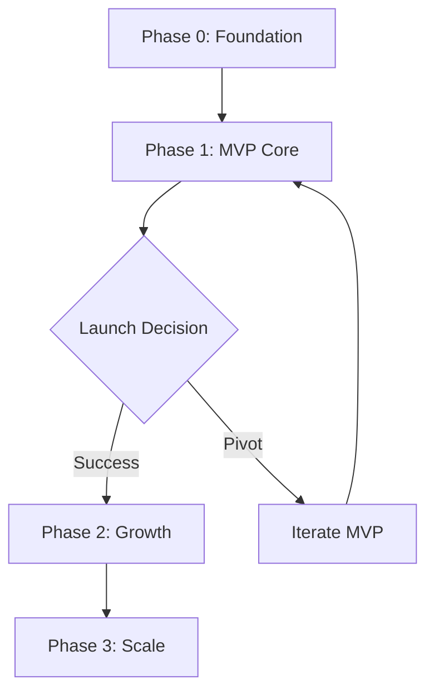

# SkillTree Development Roadmap

**Last Updated:** November 20, 2025  
**Status:** Active Development

---

## Overview

Roadmap ini memecah pengembangan SkillTree menjadi fase-fase yang manageable, dengan fokus pada delivery value incremental kepada users. Setiap fase memiliki file implementation plan tersendiri yang detail.

---

## Development Phases

```
Phase 0: Foundation (Weeks 1-4)
    ↓
Phase 1: MVP Core (Weeks 5-16) ← FOCUS FIRST
    ↓
Phase 2: Growth Features (Months 5-12)
    ↓
Phase 3: Scale & Monetization (Months 13-24)
```

---

## Phase 0: Foundation (Weeks 1-4)
**Goal:** Setup infrastructure & tooling

**Deliverables:**
- ✅ Project structure
- ✅ Dev environment setup
- ✅ Core tech stack configured
- ✅ CI/CD pipeline
- ✅ Initial data models

**Implementation Plan:** `phase-0-foundation.md`

**Success Criteria:**
- [ ] All developers can run app locally
- [ ] Automated tests run on every commit
- [ ] Database migrations work smoothly

---

## Phase 1: MVP Core (Weeks 5-16) ⭐ CRITICAL
**Goal:** Deliver core value - "Discover my skills & find matching careers"

**Deliverables:**
1. ✅ User authentication
2. ✅ RIASEC assessment (simplified 24 questions)
3. ✅ Skills inventory (50 core skills)
4. ✅ Qualitative anchors (5 levels per skill)
5. ✅ Basic career matching
6. ✅ Dashboard with visualizations

**Implementation Plan:** `phase-1-mvp-core.md`

**Success Metrics:**
- 60% onboarding completion rate
- Users add avg 10+ skills
- Users explore avg 5+ career matches
- 30% 7-day retention

**Launch Target:** Week 16 (4 months from start)

---

## Phase 2: Growth Features (Months 5-12)
**Goal:** Add differentiation & engagement drivers

**Deliverables:**
1. ✅ Interactive skill tree visualization
2. ✅ Parenting module (child profiles)
3. ✅ User-generated skills system
4. ✅ Learning path recommendations
5. ✅ Community features (pathways sharing)

**Implementation Plan:** `phase-2-growth.md`

**Success Metrics:**
- 50,000 registered users
- 15% parenting module adoption
- 500+ user-generated skills submitted
- 5% premium conversion

**Timeline:** Months 5-12

---

## Phase 3: Scale & Monetization (Months 13-24)
**Goal:** Build marketplace & enterprise features

**Deliverables:**
1. ✅ Marketplace (services listing)
2. ✅ Payment processing
3. ✅ Enterprise features (SSO, admin dashboard)
4. ✅ API partnerships
5. ✅ Advanced analytics

**Implementation Plan:** `phase-3-scale.md`

**Success Metrics:**
- 200,000 registered users
- $500K ARR
- 1,000 marketplace transactions/month
- 5 enterprise pilots

**Timeline:** Months 13-24

---

## Critical Path Dependencies



**Key Dependencies:**
- Phase 1 MUST be complete before public launch
- Phase 2 requires 10,000+ users for validation
- Phase 3 requires 50,000+ users for marketplace liquidity

---

## Resource Allocation

### Phase 1 (MVP) - Team of 4-5
- **2 Frontend Engineers** (Next.js, React, UI/UX)
- **1 Backend Engineer** (Node.js, PostgreSQL, APIs)
- **1 Full-Stack Engineer** (flexible, fill gaps)
- **0.5 Product Manager** (scope, prioritize, test)

### Phase 2 (Growth) - Team of 6-8
- Add: **1 Backend Engineer** (Neo4j, graph algorithms)
- Add: **1 Community Manager** (user-generated content)
- Add: **0.5 Data Scientist** (matching algorithms)

### Phase 3 (Scale) - Team of 10-12
- Add: **2 Full-Stack Engineers** (marketplace)
- Add: **1 DevOps Engineer** (scaling infra)
- Add: **1 Sales Engineer** (enterprise)

---

## Decision Gates

### Gate 1: MVP Launch (Week 16)
**Go/No-Go Criteria:**
- [ ] 80%+ features complete
- [ ] <5 critical bugs
- [ ] Performance: <3s page load
- [ ] 50+ beta testers validated value

**If NO-GO:** Extend Phase 1 by 4 weeks max, cut scope if needed

---

### Gate 2: Growth Investment (Month 6)
**Go/No-Go Criteria:**
- [ ] 10,000+ registered users
- [ ] 35%+ 30-day retention
- [ ] NPS >40
- [ ] Clear user demand for Phase 2 features

**If NO-GO:** Continue iterating Phase 1, delay Phase 2

---

### Gate 3: Monetization Push (Month 12)
**Go/No-Go Criteria:**
- [ ] 50,000+ registered users
- [ ] 40%+ MAU rate
- [ ] Premium tier validated (2%+ conversion)
- [ ] Marketplace demand validated (surveys)

**If NO-GO:** Focus on engagement, delay Phase 3

---

## Risk Mitigation

### Top 3 Risks & Mitigation Plans

**Risk 1: Low Onboarding Completion (<40%)**
- **Mitigation:** A/B test assessment length (24 vs 12 questions)
- **Contingency:** Ship "quick start" flow (skip assessments, manual skill entry)

**Risk 2: Poor Career Match Satisfaction (<60%)**
- **Mitigation:** Weekly user interviews, tune algorithm weights
- **Contingency:** Add "feedback loop" - users rate matches, retrain model

**Risk 3: Engagement Drops After Week 1 (<30% retention)**
- **Mitigation:** Email drip campaign, in-app notifications for new matches
- **Contingency:** Add gamification (skill streaks, achievement badges)

---

## Communication Cadence

### Weekly Standups (Phase 1)
- **Monday:** Sprint planning, prioritize tickets
- **Friday:** Demo progress, retrospective

### Bi-Weekly Reviews (Phase 2+)
- **Metrics review:** KPIs, funnel analysis
- **Roadmap adjustments:** Re-prioritize based on data

### Monthly All-Hands
- **Product updates:** What shipped, what's next
- **User stories:** Share testimonials, feedback
- **Learnings:** What worked, what didn't

---

## Next Actions

### This Week (Week 1)
1. ✅ Read `phase-0-foundation.md` 
2. ✅ Assign engineers to setup tasks
3. ✅ Create GitHub org & project board
4. ✅ Schedule kick-off meeting

### Next Week (Week 2)
1. ✅ Complete Phase 0 infrastructure setup
2. ✅ Review `phase-1-mvp-core.md` in detail
3. ✅ Break down Phase 1 into 2-week sprints
4. ✅ Start Sprint 1 (Auth + Onboarding)

---

## Phase Implementation Files

| Phase | File | Status |
|-------|------|--------|
| Phase 0 | `phase-0-foundation.md` | ✅ Ready |
| Phase 1 | `phase-1-mvp-core.md` | ✅ Ready |
| Phase 2 | `phase-2-growth.md` | ✅ Ready |
| Phase 3 | `phase-3-scale.md` | ✅ Ready |

---

## Document History

- **v1.0** (2025-11-20): Initial roadmap based on PRD
- **v1.1** (TBD): Post-Phase 0 completion updates

---

**Questions?** Contact: tech-lead@skilltree.io